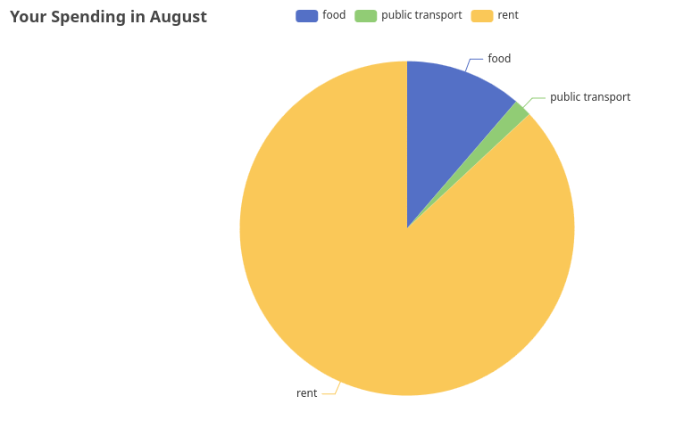

# Personal Finance Tracker (PFT) 🧮
PFT is a CLI application made with Cobra. It allows you to add financial transactions and visualize them.
## Adding a transaction
To add a new transaction use the ```add``` command:

```
/pft$ go run main.go add --date 25.08.2025 --amount 30000 --category salary --description 'August salary' --paymentmethod bank
```

### Available flags
- ```date``` should be in the format dd.mm.yyyy
- ```amount``` is the transaction amount
- ```category``` can be one of the following:
  - food
  - salary
  - public transport
  - rent
  - utilities
- ```description``` is an optional comment on the transaction
- ```payment method``` can be one of the following:
  - cash
  - credit
  - bank

## Showing your expenses per month

To show how much you have spent on each category for a month, use the ```summary``` command:

```
/pft$ go run main.go summary --month August
```

This will create a new directory called ```summaries``` where you can view the summary for each month as a pie chart.

